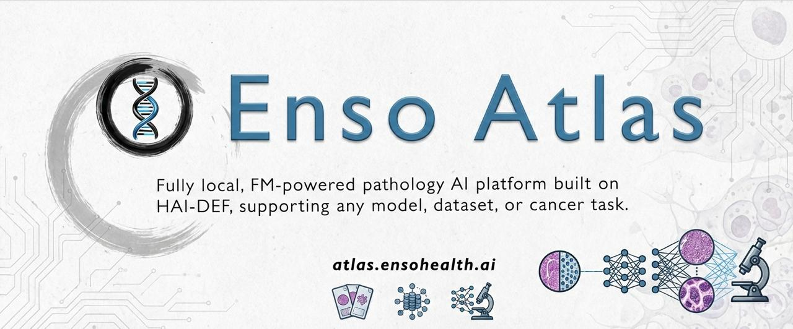
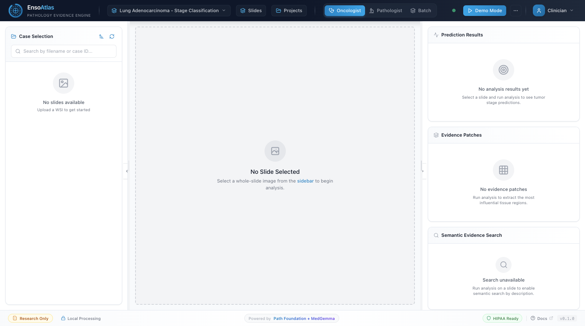
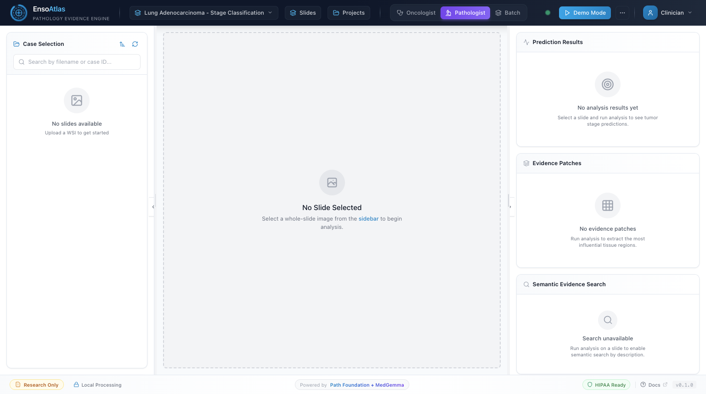
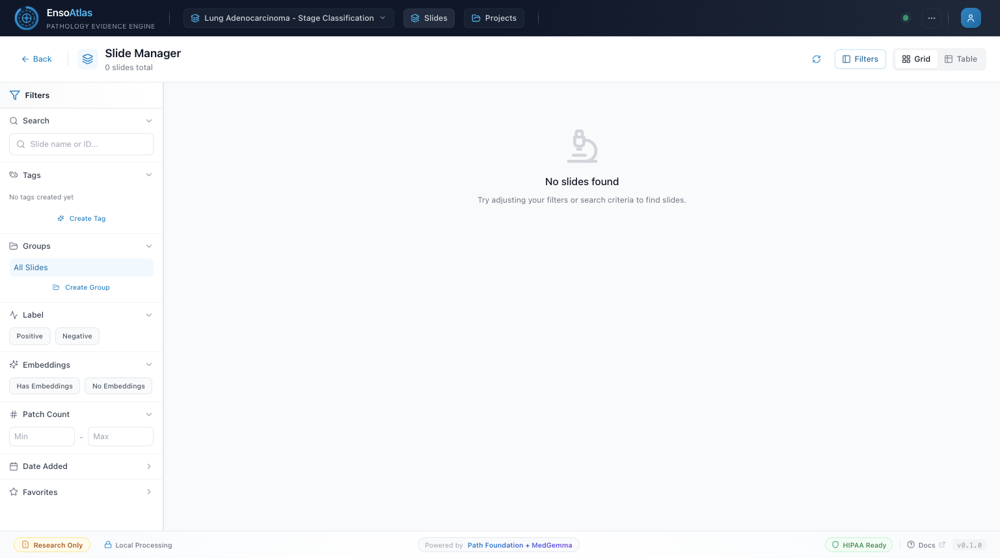
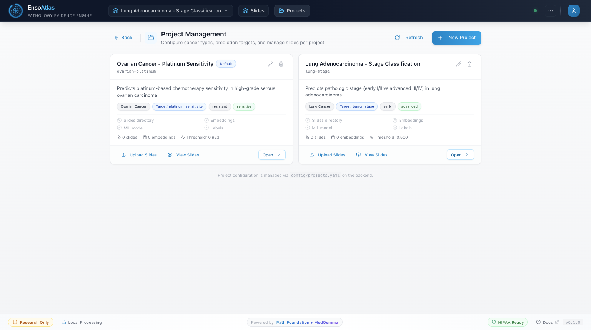

# Enso Atlas

<div align="center">



### Enso Atlas: Fully Local, FM-based Clinical Decision Support System for Pathology  
**Universal on-premise pathology AI platform: plug in any foundation model, dataset, or cancer task hassle free.**  
Built on Google Health AI Developer Foundations (HAI-DEF)

Test it out here: https://atlas.ensohealth.ai/

[](https://www.kaggle.com/competitions/med-gemma-impact-challenge/writeups/Enso-Atlas)
[](https://www.kaggle.com/competitions/med-gemma-impact-challenge)
[](#)
[](#)
[](https://www.python.org/downloads/)
[](https://opensource.org/licenses/MIT)

[Competition Write-up](https://www.kaggle.com/competitions/med-gemma-impact-challenge/writeups/Enso-Atlas) • [Documentation](docs.md) • [Quick Start](#quick-start) • [Pipeline Scripts](#pipeline-scripts)

</div>

**Last Updated:** February 24, 2026

---

## Highlights

- **Multi-project platform**: Project definitions are driven by `config/projects.yaml`; current reference projects are:
  - `ovarian-platinum` — **Ovarian Cancer - Platinum Sensitivity**
  - `lung-stage` — **Lung Adenocarcinoma - Stage Classification**
- **Strict project isolation**: Slide listing, model selection, heatmaps, similar-case retrieval, report generation, batch analysis, and async tasks are scoped by `project_id`. Core routing stays project-bound, while level-0 compatibility checks may still reference legacy embedding layout within the selected project.
- **Project-scoped model visibility**: 6 total classification models (5 ovarian + 1 lung), and each project only exposes assigned models.
- **Level-0 dense embeddings by default**: Analysis and multi-model workflows default to full-resolution level-0 embeddings.
- **Explicit backend error behavior**: Heatmap and multi-model endpoints return explicit errors for missing prerequisites:
  - `LEVEL0_EMBEDDINGS_REQUIRED`
  - `COORDS_REQUIRED_FOR_HEATMAP`
- **Heatmap rendering modes**: Truthful patch-grid overlays plus optional interpolated/smoothed view.
- **Project-aware frontend UX**: ModelPicker prunes stale model IDs on project switch; prediction panels, AI assistant, and patch zoom use project-specific language.
- **Local-first deployment**: Runs on-premise; no PHI leaves the hospital network.

## Recent Model and Pipeline Updates

- `scripts/train_transmil_finetune.py` now supports patient-level stratified k-fold CV, class-balanced epoch sampling, minority-class feature augmentation (noise injection, feature dropout, mixup), configurable patch caps (`max_train_patches`, `max_eval_patches`), single-split mode, and per-fold PR-AUC plus calibration curves.
- `scripts/multi_model_inference.py` now supports per-model decision thresholds (from `config/projects.yaml` or training outputs), wrapped checkpoint loading, CUDA OOM fallback with patch subsampling, and threshold-relative confidence calibration.
- `src/enso_atlas/mil/clam.py` now includes a `TransMILClassifier` implementation alongside CLAM, with the same public inference interface.
- `src/enso_atlas/reporting/medgemma.py` now includes structured report parsing, safety-constrained prompting, multi-section fallback behavior, and stronger generation error handling.
- New data preparation scripts are included for barcode-balanced pool rebuilding, lung stage pool prep, ovarian endpoint pool prep, and bucket H5-to-NPY conversion:
  - `scripts/rebuild_multimodel_pools_barcode_balanced.py`
  - `scripts/prepare_lung_stage_api_pool.py`
  - `scripts/prepare_ov_endpoint_api_pool.py`
  - `scripts/convert_bucket_h5_to_npy.py`
- `config/projects.yaml` now defines `decision_threshold: 0.9935` for `tumor_grade`.

---

## Screenshots

All screenshots below were refreshed from the live deployment at `https://atlas.ensohealth.ai` on Feb 24, 2026.

### Dashboard (Oncologist View)



*Oncologist summary view with prediction, similar-case counts, and top attention regions.*

### Dashboard (Pathologist View)



*Pathologist workspace with WSI controls, annotation tools, and heatmap overlays.*

### Slide Manager



*Slide inventory in grid view with filtering controls, embedding status, and patch counts.*

### Project Management



*Project cards for ovarian and lung demos, including thresholds, embeddings, and navigation actions.*

---

## Quick Start

### Docker Deployment (Recommended)

```bash
# Clone the repository
git clone https://github.com/Hilo-Hilo/enso-atlas.git
cd enso-atlas

# Build and start backend + database
docker compose -f docker/docker-compose.yaml build
docker compose -f docker/docker-compose.yaml up -d

# Backend API available at http://localhost:8003 (~3.5 min startup for MedGemma loading)

# Build and start frontend
cd frontend
npm install
npm run build
npx next start -p 3002

# Frontend available at http://localhost:3002
```

> **Portability note:** `docker/docker-compose.yaml` currently includes developer-specific absolute bind mounts. Treat it as a template and use portable local defaults (relative paths or named volumes) and/or a local override file for your machine.
>
> **CPU/GPU note:** Docker Compose can run on CPU-only hosts for basic development checks, but GPU acceleration is strongly recommended for practical embedding/inference/report latency.

### Local Development

```bash
# Create virtual environment
python -m venv .venv
source .venv/bin/activate

# Install dependencies
pip install -e .

# Start the API server (port 8000 locally, 8003 via Docker)
python -m uvicorn enso_atlas.api.main:app --reload --host 0.0.0.0 --port 8000

# In a separate terminal
cd frontend
npm install
npm run dev
# Frontend runs at http://localhost:3000 (dev) or http://localhost:3002 (production)
```

---

## Architecture

```
                        Enso Atlas Multi-Project Architecture

  config/projects.yaml
          |
          v
+----------------------+      +-------------------------+      +------------------+
|  Project Registry    |----->|   FastAPI Backend       |<-----|   Next.js 14     |
|  (project metadata,  |      |   project-scoped APIs   |      |   Frontend :3002 |
|  dataset + model map)|      |        :8003            |      +------------------+
+----------------------+      +-------------------------+
                                        |
                 +----------------------+-----------------------------+
                 |                      |                             |
                 v                      v                             v
          +-------------+        +--------------+              +-------------+
          | Path        |        | CLAM +       |              | MedGemma    |
          | Foundation  |        | TransMIL     |              | Reporting   |
          | (level-0)   |        | (project set)|              | (async)     |
          +-------------+        +--------------+              +-------------+
                 |                      |                             |
                 +----------------------+-----------------------------+
                                        |
                                 +-------------+
                                 | PostgreSQL  |
                                 | project_*   |
                                 | junctions   |
                                 +-------------+
```

### Core Components

| Component | Description |
|-----------|-------------|
| **Project Registry** | Loads `config/projects.yaml`, including project IDs, dataset paths, and per-project model assignments |
| **Project-Scoped Routing** | Endpoints enforce `project_id` scope for slides, models, analysis, retrieval, and reports |
| **WSI Processing** | OpenSlide-based processing with tissue detection |
| **Path Foundation** | 384-dim patch embeddings; level-0 dense embeddings are the default analysis path |
| **CLAM + TransMIL** | Attention-based MIL options for slide-level classification (shared classifier interface) |
| **MedSigLIP** | Text-to-patch semantic search (project-scoped availability) |
| **FAISS Retrieval** | Similar case search constrained to slides in the selected project |
| **MedGemma 1.5 4B** | Structured clinical report generation with project-aware context |
| **PostgreSQL** | Slide metadata, result caching, and project-model / project-slide assignments |

### Classification Metrics (Model Registry Metadata)

The AUC values below are demo metadata attached to configured model entries. Treat them as reference values unless you also have matching evaluation artifacts and rerun the corresponding evaluation pipeline in your environment.

| Model | Project Scope | Task | AUC |
|-------|---------------|------|-----|
| platinum_sensitivity | ovarian-platinum | Platinum treatment response | 0.907 |
| tumor_grade | ovarian-platinum | Tumor grade classification | 0.752 |
| survival_5y | ovarian-platinum | 5-year survival prediction | 0.697 |
| survival_3y | ovarian-platinum | 3-year survival prediction | 0.645 |
| survival_1y | ovarian-platinum | 1-year survival prediction | 0.639 |
| lung_stage | lung-stage | Lung adenocarcinoma stage classification (early vs advanced) | 0.648 |

Total: **6 project-scoped classification models** (5 ovarian + 1 lung).

### Tech Stack

| Layer | Technology |
|-------|------------|
| WSI I/O | OpenSlide |
| Embeddings | Path Foundation (ViT-S, 384-dim) |
| Semantic Search | MedSigLIP (text-to-patch retrieval) |
| Classification | CLAM + TransMIL (attention-based MIL) |
| Retrieval | FAISS |
| Reporting | MedGemma 1.5 4B |
| Backend | FastAPI + Python 3.10+ + asyncpg |
| Frontend | Next.js 14.2 + TypeScript + Tailwind CSS |
| Viewer | OpenSeadragon |
| Database | PostgreSQL |
| Deployment | Docker Compose on NVIDIA DGX Spark (ARM64) |

---

## API Reference

All endpoints are served at `http://localhost:8003` (Docker) or `http://localhost:8000` (local).

### Core Endpoints

```bash
# Health check
curl http://localhost:8003/api/health

# List slides in ovarian project
curl "http://localhost:8003/api/slides?project_id=ovarian-platinum"

# List project-scoped models
curl "http://localhost:8003/api/models?project_id=lung-stage"

# Multi-model analysis (renamed endpoint)
curl -X POST http://localhost:8003/api/analyze-multi \
  -H "Content-Type: application/json" \
  -d '{"slide_id": "TCGA-XX-XXXX", "project_id": "lung-stage"}'

# Batch analysis (project-scoped)
curl -X POST http://localhost:8003/api/analyze-batch \
  -H "Content-Type: application/json" \
  -d '{"slide_ids": ["slide_1", "slide_2"], "project_id": "ovarian-platinum"}'

# Generate clinical report (project-scoped)
curl -X POST http://localhost:8003/api/report \
  -H "Content-Type: application/json" \
  -d '{"slide_id": "TCGA-XX-XXXX", "project_id": "ovarian-platinum"}'

# Similar-case retrieval (project-scoped)
curl "http://localhost:8003/api/similar?slide_id=TCGA-XX-XXXX&project_id=lung-stage"
```

### Key Endpoint List (representative; see Swagger/ReDoc for full schema)

| Method | Endpoint | Description |
|--------|----------|-------------|
| GET | /api/health | Health check |
| GET | /api/slides?project_id={project_id} | List slides scoped to a project |
| GET | /api/models?project_id={project_id} | List models assigned to a project |
| POST | /api/analyze | Single-slide analysis (`project_id` in request body) |
| POST | /api/analyze-multi | Multi-model analysis (`project_id` in request body) |
| POST | /api/analyze-batch | Synchronous batch analysis (`project_id` in request body) |
| POST | /api/analyze-batch/async | Async batch analysis task (`project_id` in request body) |
| GET | /api/analyze-batch/status/{task_id} | Check async batch task status |
| POST | /api/report | Generate report (`project_id` in request body) |
| POST | /api/report/async | Async report generation (`project_id` in request body) |
| GET | /api/report/status/{task_id} | Check async report task status |
| GET | /api/similar?slide_id={id}&project_id={project_id} | Similar-case retrieval within project scope |
| POST | /api/semantic-search | MedSigLIP semantic search (`project_id` in request body) |
| GET | /api/heatmap/{slide_id}?project_id={project_id}&smooth={bool} | Slide heatmap with optional interpolation |
| GET | /api/heatmap/{slide_id}/{model_id}?project_id={project_id}&smooth={bool} | Model-specific attention heatmap |
| GET/POST | /api/projects | List/create projects |
| GET/PUT/DELETE | /api/projects/{project_id} | Read/update/delete one project |
| GET/POST/DELETE | /api/projects/{project_id}/slides | Assign/unassign slides per project |
| GET/POST/DELETE | /api/projects/{project_id}/models | Assign/unassign models per project |

### Error Behavior for Missing Prerequisites

Heatmap and multi-model analysis paths return explicit errors instead of silent fallback behavior:

- `LEVEL0_EMBEDDINGS_REQUIRED` when level-0 embeddings are unavailable
- `COORDS_REQUIRED_FOR_HEATMAP` when `*_coords.npy` is missing

### Interactive Documentation

- Swagger UI: [http://localhost:8003/api/docs](http://localhost:8003/api/docs)
- ReDoc: [http://localhost:8003/api/redoc](http://localhost:8003/api/redoc)

---

## Expected Project Structure

The tree below shows the expected layout for a configured deployment. In a clean clone, large datasets/models are often mounted or generated externally.

```
med-gemma-hackathon/
|-- src/enso_atlas/
|   |-- api/           # FastAPI endpoints
|   |-- embedding/     # Path Foundation embedder
|   |-- evidence/      # Heatmaps and FAISS retrieval
|   |-- mil/           # CLAM + TransMIL attention classifiers
|   |-- reporting/     # MedGemma report generation
|   |-- wsi/           # WSI processing
|-- frontend/          # Next.js 14.2 application
|-- docker/            # Docker Compose configuration
|-- config/            # projects.yaml and configuration
|-- data/
|   |-- projects/
|   |   |-- ovarian-platinum/   # example project directory
|   |   |   |-- slides/
|   |   |   |-- embeddings/
|   |   |   \-- labels.csv
|   |   \-- lung-stage/         # example project directory
|   |       |-- slides/
|   |       |-- embeddings/
|   |       \-- labels.json
|-- models/            # Trained TransMIL weights
|-- tests/             # Unit tests
|-- docs/              # Documentation and screenshots
```

### Data Layout

Per-project datasets are expected to follow a modular structure (either in-repo or external paths configured in `config/projects.yaml`):

- `data/projects/{project-id}/slides/`
- `data/projects/{project-id}/embeddings/`
- `data/projects/{project-id}/labels.csv` or `labels.json`

This replaces earlier flat dataset assumptions and enables independent project lifecycle management.

**Level-0 reliability guardrail:** keep `data/projects/{project-id}/embeddings/level0/` synchronized with top-level `embeddings/*.npy` files (including `*_coords.npy`).
After embedding updates or migrations, run:

```bash
python scripts/validate_project_modularity.py --check-embedding-layout
```

If this check fails, level-0 heatmaps and analysis can report missing level-0 embeddings even when flat embeddings exist.

---

## Configuration

### Environment Variables

| Variable | Description | Default |
|----------|-------------|---------|
| `CUDA_VISIBLE_DEVICES` | GPU selection | All GPUs |
| `NEXT_PUBLIC_API_URL` | Frontend API URL | *(empty = same-origin `/api`)* |

**Public deployment note:** for Cloudflare/Tailscale public hosting, keep `NEXT_PUBLIC_API_URL` empty so browsers call the same origin (`/api/...`). Hardcoding a private/Tailnet IP can cause "backend disconnected" for public users.

### Project Configuration

Projects are managed via `config/projects.yaml` and `/api/projects` CRUD endpoints.

Current reference projects:
- `ovarian-platinum`: Ovarian Cancer - Platinum Sensitivity
- `lung-stage`: Lung Adenocarcinoma - Stage Classification

Project isolation is enforced in API routing and task execution, including batch analysis and async report generation.

Model-level decision thresholds can also be set in `config/projects.yaml` (for example, `tumor_grade` currently uses `decision_threshold: 0.9935`).

---

## Dataset

`config/projects.yaml` includes two reference project configurations:

- **Ovarian cancer cohort configuration** for platinum sensitivity, tumor grade, and survival classification
- **Lung adenocarcinoma cohort configuration** for stage classification

In many deployments, raw WSIs/embeddings are stored outside this repository and mounted into the configured dataset paths. When available, Path Foundation level-0 dense embeddings are the default analysis path.

---

## Docker Deployment

Services are defined in `docker/docker-compose.yaml`:

| Service | Description | Port |
|---------|-------------|------|
| enso-atlas | FastAPI backend + ML models | 8003 (host) -> 8000 (container) |
| atlas-db | PostgreSQL database | 5433 |

The backend takes approximately 3.5 minutes to fully start due to MedGemma model loading. The frontend runs separately outside Docker.

Before launching in a new environment, update host bind mounts in Compose (or layer an override file) so paths are valid on your machine.

See [docs.md](docs.md) (Hospital Deployment Guide section) for detailed deployment instructions.

---

## Development

### Running Tests

```bash
pytest tests/
pytest --cov=src tests/
```

### Code Quality

```bash
ruff check src/
black src/ --check
mypy src/

cd frontend && npm run lint
```

---

## Acknowledgments

- **Google Health AI** for Path Foundation, MedGemma, and MedSigLIP
- **NVIDIA** for DGX Spark compute resources
- **TCGA** for ovarian and lung whole-slide image datasets
- [TransMIL](https://github.com/szc19990412/TransMIL) for the Transformer-based MIL architecture

---

## License

MIT License - See [LICENSE](LICENSE) for details.

---

## References

1. Shao et al., "TransMIL: Transformer based Correlated Multiple Instance Learning for Whole Slide Image Classification," *NeurIPS*, 2021.
2. Google Health AI, [Path Foundation](https://developers.google.com/health-ai-developer-foundations/path-foundation)
3. Google, [MedGemma](https://developers.google.com/health-ai-developer-foundations/medgemma)
4. Google Health AI, [MedSigLIP](https://developers.google.com/health-ai-developer-foundations/medsiglip)
