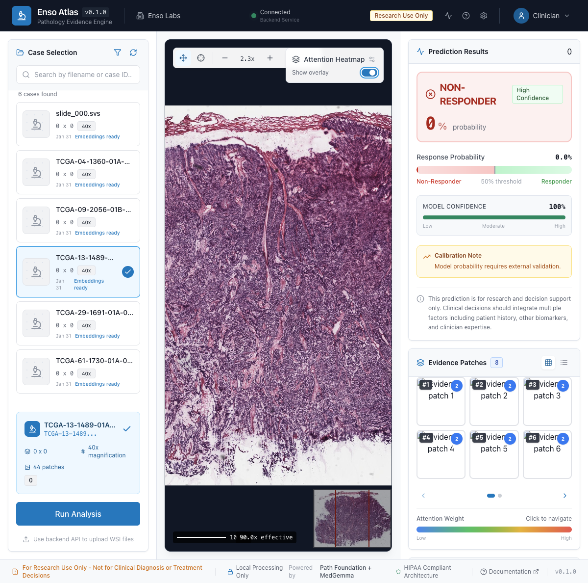
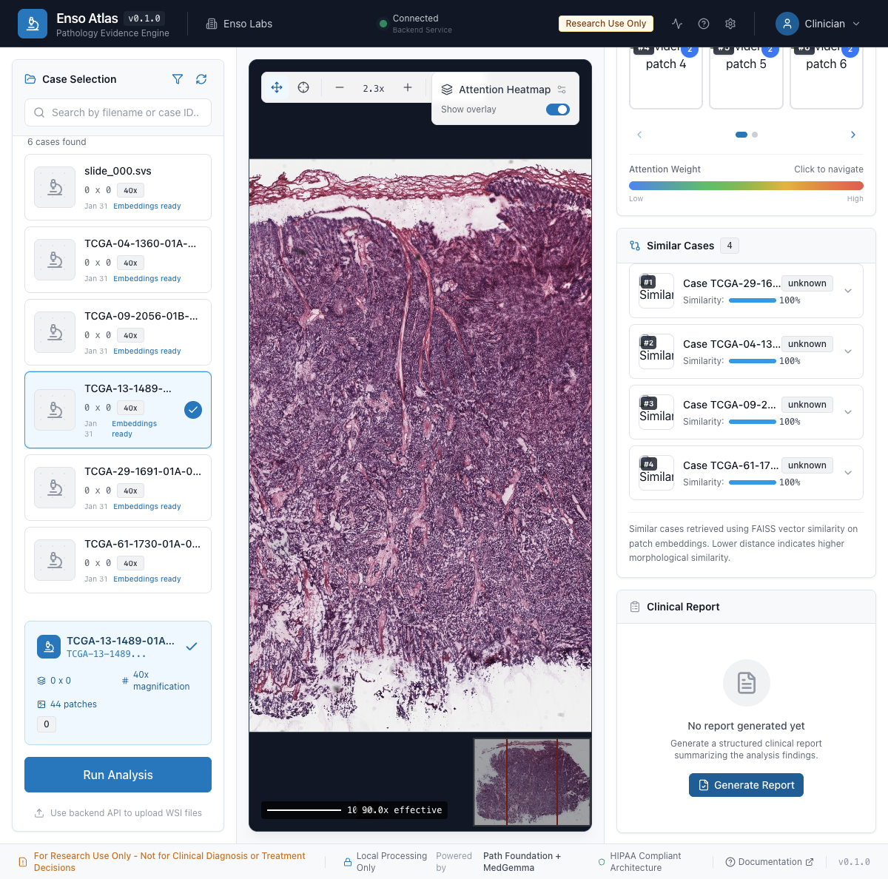

# Enso Atlas

[](https://www.python.org/downloads/)
[](https://opensource.org/licenses/MIT)
[](https://github.com/psf/black)

**On-Prem Pathology Evidence Engine for Treatment-Response Insight**

Enso Atlas is an on-premise pathology evidence engine that analyzes whole-slide images (WSIs) to predict treatment response and provides interpretable, auditable evidence for clinical decision support.

---

## Highlights

- **Local-first**: Runs entirely on-premise; no PHI leaves the hospital network
- **Evidence-based**: Heatmaps + patch retrieval + structured reports provide auditable evidence
- **Foundation-model agnostic**: Swap embedding models without changing the architecture
- **Production-ready**: FastAPI backend + Next.js frontend with OpenSeadragon WSI viewer

---

## Screenshots

### Main Application View


*Enso Atlas main interface showing the case selection panel, WSI viewer, and analysis panels.*

### Analysis Results with Prediction Panel


*Complete analysis showing NON-RESPONDER prediction with high confidence (100%), response probability bar, and evidence patches grid.*

### WSI Viewer with Heatmap Overlay



*OpenSeadragon-based whole-slide image viewer with attention heatmap overlay toggle, zoom controls, and minimap navigation.*

### Similar Cases Panel



*FAISS-powered similar case retrieval showing morphologically similar cases from the reference cohort with similarity scores.*

### Prediction and Evidence Panels


*Detailed view showing the prediction results (confidence score, response probability threshold), evidence patches ranked by attention weight, and calibration notes.*

---

## Quick Start

### Prerequisites

- Python 3.10+
- Node.js 18+ (for frontend)
- NVIDIA GPU with CUDA support (recommended)
- OpenSlide library installed

### Installation

```bash
# Clone the repository
git clone https://github.com/Hilo-Hilo/med-gemma-hackathon.git
cd med-gemma-hackathon

# Create virtual environment
python -m venv .venv
source .venv/bin/activate

# Install dependencies
pip install -e .

# Generate demo data
python scripts/generate_demo_data.py --train-model

# Start the API server
python -m uvicorn enso_atlas.api.main:app --reload --host 0.0.0.0 --port 8000
```

### Frontend Setup

```bash
cd frontend
npm install
npm run dev
# Frontend runs at http://localhost:3000
```

### Gradio Demo

```bash
python -m enso_atlas.ui.demo_app
# Demo runs at http://localhost:7860
```

---

## Architecture

```
                           Enso Atlas Architecture

    +------------------+     +------------------+     +------------------+
    |   WSI Input      |     |   FastAPI        |     |   Next.js        |
    |   (.svs, .ndpi)  |---->|   Backend        |<----|   Frontend       |
    +------------------+     +------------------+     +------------------+
                                    |
           +------------------------+------------------------+
           |                        |                        |
           v                        v                        v
    +-------------+          +-------------+          +-------------+
    |   Path      |          |   CLAM      |          |   FAISS     |
    |   Foundation|          |   MIL Head  |          |   Index     |
    +-------------+          +-------------+          +-------------+
                                    |
                                    v
                          +------------------+
                          |   MedGemma       |
                          |   Reporter       |
                          +------------------+
```

### Core Components

| Component | Description |
|-----------|-------------|
| **WSI Processing** | OpenSlide-based processing with tissue detection |
| **Path Foundation** | 384-dim embeddings from Google's foundation model |
| **CLAM Classifier** | Attention-based MIL for slide-level prediction |
| **Evidence Heatmaps** | Attention visualization overlaid on thumbnails |
| **FAISS Retrieval** | Similar case search from reference cohort |
| **MedGemma Reports** | Structured JSON reports with safety guardrails |

### Tech Stack

| Layer | Technology |
|-------|------------|
| WSI I/O | OpenSlide |
| Embeddings | Path Foundation (ViT-S, 384-dim) |
| Classification | CLAM (Gated Attention MIL) |
| Retrieval | FAISS |
| Reporting | MedGemma 1.5 4B |
| Backend | FastAPI + Python 3.10+ |
| Frontend | Next.js 14 + TypeScript + Tailwind CSS |
| Viewer | OpenSeadragon |

---

## API Reference

### Health Check

```bash
curl http://localhost:8000/health
```

### Analyze Slide

```bash
curl -X POST http://localhost:8000/api/analyze \
  -H "Content-Type: application/json" \
  -d '{"slide_id": "slide_001"}'
```

### Generate Report

```bash
curl -X POST http://localhost:8000/api/report \
  -H "Content-Type: application/json" \
  -d '{"slide_id": "slide_001", "include_evidence": true}'
```

### Full API Documentation

- Swagger UI: [http://localhost:8000/api/docs](http://localhost:8000/api/docs)
- ReDoc: [http://localhost:8000/api/redoc](http://localhost:8000/api/redoc)

---

## Project Structure

```
med-gemma-hackathon/
|-- src/enso_atlas/
|   |-- api/           # FastAPI endpoints
|   |-- embedding/     # Path Foundation embedder
|   |-- evidence/      # Heatmaps and FAISS retrieval
|   |-- mil/           # CLAM attention classifier
|   |-- reporting/     # MedGemma report generation
|   |-- wsi/           # WSI processing
|   |-- ui/            # Gradio interfaces
|-- frontend/          # Next.js application
|-- scripts/           # Utility scripts
|-- config/            # Configuration files
|-- data/              # Demo data and embeddings
|-- models/            # Model weights
|-- tests/             # Unit tests
```

---

## Configuration

### Environment Variables

| Variable | Description | Default |
|----------|-------------|---------|
| `CUDA_VISIBLE_DEVICES` | GPU selection | All GPUs |
| `ENSO_ATLAS_PORT` | API server port | 8000 |
| `NEXT_PUBLIC_API_URL` | Frontend API URL | http://localhost:8000 |

### Configuration Files

See `config/default.yaml` for full configuration options including:
- WSI processing parameters
- Embedding model settings
- MIL classifier hyperparameters
- MedGemma generation settings

---

## Development

### Running Tests

```bash
pytest tests/
pytest --cov=src tests/  # With coverage
```

### Code Quality

```bash
# Linting
ruff check src/
black src/ --check

# Type checking
mypy src/

# Frontend
cd frontend && npm run lint
```

---

## Dataset

The prototype uses the **Ovarian Bevacizumab Response Dataset**:

> 288 de-identified H&E WSIs from 78 patients with treatment response labels

Reference: [Nature Scientific Data](https://www.nature.com/articles/s41597-022-01127-6)

---

## Acknowledgments

- **Google Health AI** for Path Foundation and MedGemma
- **NVIDIA** for DGX Spark compute resources
- Authors of the Ovarian Bevacizumab Response Dataset
- [CLAM](https://github.com/mahmoodlab/CLAM) for the MIL architecture reference

---

## License

MIT License - See [LICENSE](LICENSE) for details.

---

## References

1. Lu et al., "Data-efficient and weakly supervised computational pathology on whole-slide images," *Nature Biomedical Engineering*, 2021.
2. Google Health AI, [Path Foundation](https://developers.google.com/health-ai-developer-foundations/path-foundation)
3. Google, [MedGemma](https://developers.google.com/health-ai-developer-foundations/medgemma)
