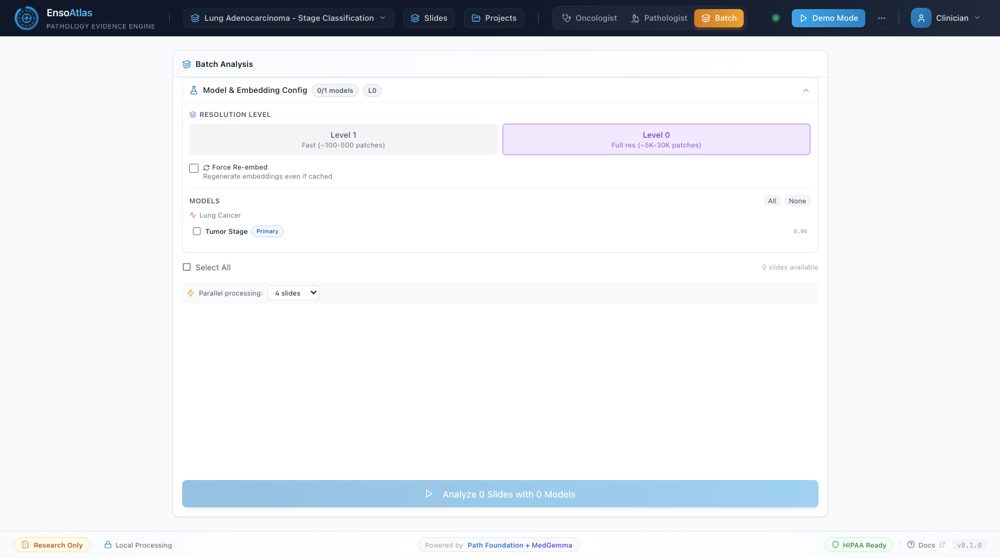

# Enso Atlas

[](https://www.python.org/downloads/)
[](https://opensource.org/licenses/MIT)
[](https://github.com/psf/black)

**On-Premise Multi-Cancer Pathology Evidence Platform for Project-Scoped Clinical AI**

Enso Atlas is an on-premise pathology evidence platform that analyzes whole-slide images (WSIs) using TransMIL attention-based classification, Path Foundation embeddings, MedSigLIP retrieval, and MedGemma reporting across multiple cancer projects with strict project isolation.

**Last Updated:** February 20, 2026

---

## Highlights

- **Multi-project platform**: Project definitions are driven by `config/projects.yaml`.
  - `ovarian-platinum` — **Ovarian Cancer - Platinum Sensitivity**
  - `lung-stage` — **Lung Adenocarcinoma - Stage Classification**
- **Strict project isolation**: Slide listing, model selection, heatmaps, similar-case retrieval, report generation, batch analysis, and async tasks are scoped by `project_id` with no cross-project fallback.
- **Project-scoped model visibility**: 6 total classification models (5 ovarian + 1 lung), and each project only exposes assigned models.
- **Level-0 dense embeddings by default**: Analysis and multi-model workflows default to full-resolution level-0 embeddings.
- **Explicit backend error behavior**: Heatmap and multi-model endpoints return explicit errors for missing prerequisites:
  - `LEVEL0_EMBEDDINGS_REQUIRED`
  - `COORDS_REQUIRED_FOR_HEATMAP`
- **Heatmap rendering modes**: Truthful patch-grid overlays plus optional interpolated/smoothed view.
- **Project-aware frontend UX**: ModelPicker prunes stale model IDs on project switch; prediction panels, AI assistant, and patch zoom use project-specific language.
- **Local-first deployment**: Runs on-premise; no PHI leaves the hospital network.

---

## Screenshots

### Dashboard (Oncologist View)


*Current UI in Oncologist mode with project-scoped model selection and evidence panels.*

### Dashboard (Pathologist View)


*Current UI in Pathologist mode with project-aware interpretation workflow and tool visibility.*

### Batch Analysis



*Batch analysis view showing project-scoped model selection, resolution controls, and cohort-level run setup.*

### Slide Manager


*Project-scoped slide inventory with filtering, readiness metadata, and per-project organization controls.*

### Project Management


*Project configuration and assignment workflow backed by `config/projects.yaml` and project-specific data/model mappings.*

---

## Quick Start

### Docker Deployment (Recommended)

```bash
# Clone the repository
git clone https://github.com/Hilo-Hilo/med-gemma-hackathon.git
cd med-gemma-hackathon

# Build and start backend + database
docker compose -f docker/docker-compose.yaml build
docker compose -f docker/docker-compose.yaml up -d

# Backend API available at http://localhost:8003 (~3.5 min startup for MedGemma loading)

# Build and start frontend
cd frontend
npm install
npm run build
npx next start -p 3002

# Frontend available at http://localhost:3002
```

### Local Development

```bash
# Create virtual environment
python -m venv .venv
source .venv/bin/activate

# Install dependencies
pip install -e .

# Start the API server (port 8000 locally, 8003 via Docker)
python -m uvicorn enso_atlas.api.main:app --reload --host 0.0.0.0 --port 8000

# In a separate terminal
cd frontend
npm install
npm run dev
# Frontend runs at http://localhost:3000 (dev) or http://localhost:3002 (production)
```

---

## Architecture

```
                        Enso Atlas Multi-Project Architecture

  config/projects.yaml
          |
          v
+----------------------+      +-------------------------+      +------------------+
|  Project Registry    |----->|   FastAPI Backend       |<-----|   Next.js 14     |
|  (project metadata,  |      |   project-scoped APIs   |      |   Frontend :3002 |
|  dataset + model map)|      |        :8003            |      +------------------+
+----------------------+      +-------------------------+
                                        |
                 +----------------------+-----------------------------+
                 |                      |                             |
                 v                      v                             v
          +-------------+        +--------------+              +-------------+
          | Path        |        | TransMIL     |              | MedGemma    |
          | Foundation  |        | Classifiers  |              | Reporting   |
          | (level-0)   |        | (project set)|              | (async)     |
          +-------------+        +--------------+              +-------------+
                 |                      |                             |
                 +----------------------+-----------------------------+
                                        |
                                 +-------------+
                                 | PostgreSQL  |
                                 | project_*   |
                                 | junctions   |
                                 +-------------+
```

### Core Components

| Component | Description |
|-----------|-------------|
| **Project Registry** | Loads `config/projects.yaml`, including project IDs, dataset paths, and per-project model assignments |
| **Project-Scoped Routing** | Endpoints enforce `project_id` scope for slides, models, analysis, retrieval, and reports |
| **WSI Processing** | OpenSlide-based processing with tissue detection |
| **Path Foundation** | 384-dim patch embeddings; level-0 dense embeddings are the default analysis path |
| **TransMIL** | Transformer-based MIL for slide-level classification |
| **MedSigLIP** | Text-to-patch semantic search (project-scoped availability) |
| **FAISS Retrieval** | Similar case search constrained to slides in the selected project |
| **MedGemma 1.5 4B** | Structured clinical report generation with project-aware context |
| **PostgreSQL** | Slide metadata, result caching, and project-model / project-slide assignments |

### Classification Results

| Model | Project Scope | Task | AUC |
|-------|---------------|------|-----|
| platinum_sensitivity | ovarian-platinum | Platinum treatment response | 0.907 |
| tumor_grade | ovarian-platinum | Tumor grade classification | 0.752 |
| survival_5y | ovarian-platinum | 5-year survival prediction | 0.697 |
| survival_3y | ovarian-platinum | 3-year survival prediction | 0.645 |
| survival_1y | ovarian-platinum | 1-year survival prediction | 0.639 |
| lung_stage | lung-stage | Lung adenocarcinoma stage classification (early vs advanced) | 0.648 |

Total: **6 project-scoped classification models** (5 ovarian + 1 lung).

### Tech Stack

| Layer | Technology |
|-------|------------|
| WSI I/O | OpenSlide |
| Embeddings | Path Foundation (ViT-S, 384-dim) |
| Semantic Search | MedSigLIP (text-to-patch retrieval) |
| Classification | TransMIL (Transformer-based MIL) |
| Retrieval | FAISS |
| Reporting | MedGemma 1.5 4B |
| Backend | FastAPI + Python 3.10+ + asyncpg |
| Frontend | Next.js 14.2 + TypeScript + Tailwind CSS |
| Viewer | OpenSeadragon |
| Database | PostgreSQL |
| Deployment | Docker Compose on NVIDIA DGX Spark (ARM64) |

---

## API Reference

All endpoints are served at `http://localhost:8003` (Docker) or `http://localhost:8000` (local).

### Core Endpoints

```bash
# Health check
curl http://localhost:8003/api/health

# List slides in ovarian project
curl "http://localhost:8003/api/slides?project_id=ovarian-platinum"

# List project-scoped models
curl "http://localhost:8003/api/models?project_id=lung-stage"

# Multi-model analysis (renamed endpoint)
curl -X POST http://localhost:8003/api/analyze-multi \
  -H "Content-Type: application/json" \
  -d '{"slide_id": "TCGA-XX-XXXX", "project_id": "lung-stage"}'

# Batch analysis (project-scoped)
curl -X POST http://localhost:8003/api/analyze-batch \
  -H "Content-Type: application/json" \
  -d '{"slide_ids": ["slide_1", "slide_2"], "project_id": "ovarian-platinum"}'

# Generate clinical report (project-scoped)
curl -X POST http://localhost:8003/api/report \
  -H "Content-Type: application/json" \
  -d '{"slide_id": "TCGA-XX-XXXX", "project_id": "ovarian-platinum"}'

# Similar-case retrieval (project-scoped)
curl "http://localhost:8003/api/similar?slide_id=TCGA-XX-XXXX&project_id=lung-stage"
```

### Full Endpoint List

| Method | Endpoint | Description |
|--------|----------|-------------|
| GET | /api/health | Health check |
| GET | /api/slides?project_id={project_id} | List slides scoped to a project |
| GET | /api/models?project_id={project_id} | List models assigned to a project |
| POST | /api/analyze | Single-slide analysis (`project_id` in request body) |
| POST | /api/analyze-multi | Multi-model analysis (`project_id` in request body) |
| POST | /api/analyze-batch | Synchronous batch analysis (`project_id` in request body) |
| POST | /api/analyze-batch/async | Async batch analysis task (`project_id` in request body) |
| GET | /api/analyze-batch/status/{task_id} | Check async batch task status |
| POST | /api/report | Generate report (`project_id` in request body) |
| POST | /api/report/async | Async report generation (`project_id` in request body) |
| GET | /api/report/status/{task_id} | Check async report task status |
| GET | /api/similar?slide_id={id}&project_id={project_id} | Similar-case retrieval within project scope |
| POST | /api/semantic-search | MedSigLIP semantic search (`project_id` in request body) |
| GET | /api/heatmap/{slide_id}?project_id={project_id}&smooth={bool} | Slide heatmap with optional interpolation |
| GET | /api/heatmap/{slide_id}/{model_id}?project_id={project_id}&smooth={bool} | Model-specific attention heatmap |
| GET/POST/PUT/DELETE | /api/projects | Project CRUD |
| GET/POST/DELETE | /api/projects/{project_id}/slides | Assign/unassign slides per project |
| GET/POST/DELETE | /api/projects/{project_id}/models | Assign/unassign models per project |

### Error Behavior for Missing Prerequisites

Heatmap and multi-model analysis paths return explicit errors instead of silent fallback behavior:

- `LEVEL0_EMBEDDINGS_REQUIRED` when level-0 embeddings are unavailable
- `COORDS_REQUIRED_FOR_HEATMAP` when `*_coords.npy` is missing

### Interactive Documentation

- Swagger UI: [http://localhost:8003/api/docs](http://localhost:8003/api/docs)
- ReDoc: [http://localhost:8003/api/redoc](http://localhost:8003/api/redoc)

---

## Project Structure

```
med-gemma-hackathon/
|-- src/enso_atlas/
|   |-- api/           # FastAPI endpoints
|   |-- embedding/     # Path Foundation embedder
|   |-- evidence/      # Heatmaps and FAISS retrieval
|   |-- mil/           # TransMIL attention classifier
|   |-- reporting/     # MedGemma report generation
|   |-- wsi/           # WSI processing
|-- frontend/          # Next.js 14.2 application
|-- docker/            # Docker Compose configuration
|-- config/            # projects.yaml and configuration
|-- data/
|   |-- projects/
|   |   |-- ovarian-platinum/
|   |   |   |-- slides/
|   |   |   |-- embeddings/
|   |   |   \-- labels.csv
|   |   \-- lung-stage/
|   |       |-- slides/
|   |       |-- embeddings/
|   |       \-- labels.json
|-- models/            # Trained TransMIL weights
|-- tests/             # Unit tests
|-- docs/              # Documentation and screenshots
```

### Data Layout

Per-project datasets follow a modular structure:

- `data/projects/{project-id}/slides/`
- `data/projects/{project-id}/embeddings/`
- `data/projects/{project-id}/labels.csv` or `labels.json`

This replaces earlier flat dataset assumptions and enables independent project lifecycle management.

**Level-0 reliability guardrail:** keep `data/projects/{project-id}/embeddings/level0/` synchronized with top-level `embeddings/*.npy` files (including `*_coords.npy`).
After embedding updates or migrations, run:

```bash
python scripts/validate_project_modularity.py --check-embedding-layout
```

If this check fails, level-0 heatmaps and analysis can report missing level-0 embeddings even when flat embeddings exist.

---

## Configuration

### Environment Variables

| Variable | Description | Default |
|----------|-------------|---------|
| `CUDA_VISIBLE_DEVICES` | GPU selection | All GPUs |
| `NEXT_PUBLIC_API_URL` | Frontend API URL | *(empty = same-origin `/api`)* |

**Public deployment note:** for Cloudflare/Tailscale public hosting, keep `NEXT_PUBLIC_API_URL` empty so browsers call the same origin (`/api/...`). Hardcoding a private/Tailnet IP can cause "backend disconnected" for public users.

### Project Configuration

Projects are managed via `config/projects.yaml` and `/api/projects` CRUD endpoints.

Configured projects:
- `ovarian-platinum`: Ovarian Cancer - Platinum Sensitivity
- `lung-stage`: Lung Adenocarcinoma - Stage Classification

Project isolation is enforced in API routing and task execution, including batch analysis and async report generation.

---

## Dataset

The platform currently supports two project datasets:

- **Ovarian cancer cohort** for platinum sensitivity, tumor grade, and survival classification
- **Lung adenocarcinoma cohort** for stage classification

Both use Path Foundation embeddings, with level-0 dense embeddings as the default analysis path.

---

## Docker Deployment

Services are defined in `docker/docker-compose.yaml`:

| Service | Description | Port |
|---------|-------------|------|
| enso-atlas | FastAPI backend + ML models | 8003 (host) -> 8000 (container) |
| atlas-db | PostgreSQL database | 5433 |

The backend takes approximately 3.5 minutes to fully start due to MedGemma model loading. The frontend runs separately outside Docker.

See [docs/reproduce.md](docs/reproduce.md) for detailed deployment instructions.

---

## Development

### Running Tests

```bash
pytest tests/
pytest --cov=src tests/
```

### Code Quality

```bash
ruff check src/
black src/ --check
mypy src/

cd frontend && npm run lint
```

---

## Acknowledgments

- **Google Health AI** for Path Foundation, MedGemma, and MedSigLIP
- **NVIDIA** for DGX Spark compute resources
- **TCGA** for ovarian and lung whole-slide image datasets
- [TransMIL](https://github.com/szc19990412/TransMIL) for the Transformer-based MIL architecture

---

## License

MIT License - See [LICENSE](LICENSE) for details.

---

## References

1. Shao et al., "TransMIL: Transformer based Correlated Multiple Instance Learning for Whole Slide Image Classification," *NeurIPS*, 2021.
2. Google Health AI, [Path Foundation](https://developers.google.com/health-ai-developer-foundations/path-foundation)
3. Google, [MedGemma](https://developers.google.com/health-ai-developer-foundations/medgemma)
4. Google Health AI, [MedSigLIP](https://developers.google.com/health-ai-developer-foundations/medsiglip)
